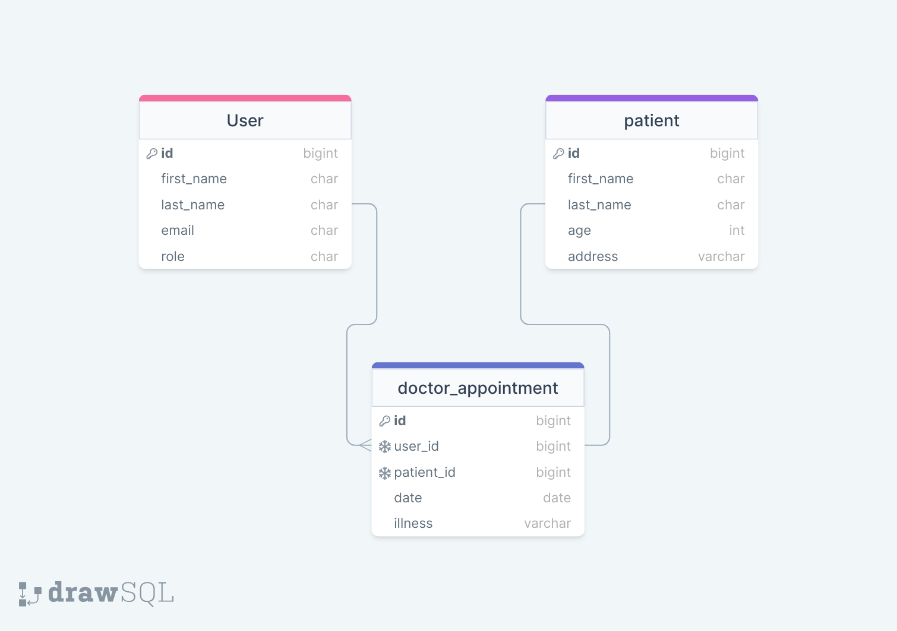

<a name="readme-top"></a>

<div align="center">

<h1><b>HOSPITAL APP</b></h1>
 
  
  <br/>


https://github.com/user-attachments/assets/872d4fe3-37a0-47ca-9c95-808ba6d35a16


</div>


# 📗 Table of Contents

- [📖 About the Project](#about-project)
  - [🛠 Built With](#built-with)
    - [Tech Stack](#tech-stack)
    - [Key Features](#key-features)
  - [🚀 Live Demo](#live-demo)
- [💻 Getting Started](#getting-started)
  - [Prerequisites](#prerequisites)
  - [Setup](#setup)
  - [Install](#install)
  - [Usage](#usage)
  - [Run tests](#run-tests)
- [👥 Authors](#authors)
- [🔭 Future Features](#future-features)
- [🤝 Contributing](#contributing)
- [⭐️ Show your support](#support)
- [❓ FAQ](#faq)
- [📝 License](#license)

# 📖 [HOSPITAL APP] <a name="about-project"></a>

**[HOSPITAL APP]**  A web-based hospital management system built with Ruby on Rails, designed to streamline patient registration and management. The application features a unified login portal for both receptionists and doctors, allowing receptionists to register patients and manage their records, while doctors can view registered patients and visualize patient registrations over days through graphs.

## 🛠 Built With <a name="built-with"></a>

1- Ruby 3.2.2<br>
2- Rails 7.0.7.2<br>
3- PostgreSQL<br>
4- Gitflow<br>
5- Rubocop<br>
6- RSpec

### Tech Stack <a name="tech-stack"></a>

<details>
  <summary>Client</summary>
  <ul>
    <li><a href="www.makerble.com/">Makerble</a></li>
  </ul>
</details>

<details>
<summary>Rails</summary>
  <ul>
    <li><a href="https://www.rubyonrails.org/">Ruby on Rails</a></li>
  </ul>
</details>

<details>
<summary>Database</summary>
  <ul>
    <li><a href="https://www.postgresql.org/">PostgreSQL</a></li>
  </ul>
</details>

### Key Features <a name="key-features"></a>

- **[User Authentication]**: Users can sign up, log in, and log out of the application.
- **[User Authorization]**: Users can only access certain pages based on their role.
- **[Patient Registration]**: Receptionists can register patients with their details.
- **[Patient Management]**: Receptionists can view and manage patient records.
- **[Doctor Portal]**: Doctors can view registered patients and visualize patient registrations over days through graphs.
- **[Unified Login]**: Both receptionists and doctors can log in through a unified login portal.


<p align="right">(<a href="#readme-top">back to top</a>)</p>

## 🚀 Live Demo <a name="live-demo"></a>

- [Sorry I have exhausted my Render database, I cannot deply this at the moment]()

<p align="right">(<a href="#readme-top">back to top</a>)</p>

## 💻 Getting Started <a name="getting-started"></a>

To get a local copy up and running, follow these steps.

### Prerequisites

In order to run this project you need:

Web Browser (Chrome recommended)<br>
Code editor (VS recommended)<br>
GitHub account<br>

### Setup

Clone this repository to your desired folder:

```sh
  cd my-folder
  git clone "https://github.com/Abdulkalam14/MarkableTask.git"
```
### Install

Go to your /hospital_app folder:

```sh
  cd hospital_app
  bundle install
  rails server
```

### Usage

```sh
  rails server
```

### Run Tests

```sh
  rspec spec
```

or

```sh
  rspec spec -f d -c
```
for a detailed test info


<p align="right">(<a href="#readme-top">back to top</a>)</p>


